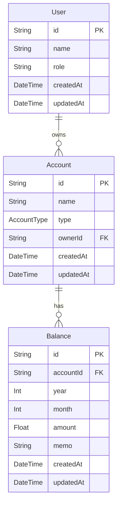

# DB 設計 (Database Design)

## ER 図 (Mermaid)

## テーブル仕様書

### User (家族メンバー)
| Column | Type | Description |
|---|---|---|
| id | String | CUID |
| name | String | 表示名 |
| role | String? | 役割 (例: 父, 母) |
| createdAt | DateTime | 作成日時 |
| updatedAt | DateTime | 更新日時 |

### Account (口座情報)
| Column | Type | Description |
|---|---|---|
| id | String | CUID |
| name | String | 口座名 (例: 三菱UFJ銀行, 楽天証券) |
| type | Enum | BANK, SECURITIES, IDECO, GOLD, GOODS |
| ownerId | String | Userテーブルへの外部キー |
| createdAt | DateTime | 作成日時 |
| updatedAt | DateTime | 更新日時 |

### Balance (月次残高)
| Column | Type | Description |
|---|---|---|
| id | String | CUID |
| accountId | String | Accountテーブルへの外部キー |
| year | Int | 対象年 (YYYY) |
| month | Int | 対象月 (1-12) |
| amount | Float | 残高金額 |
| memo | String? | メモ書き |
| createdAt | DateTime | 作成日時 |
| updatedAt | DateTime | 更新日時 |

## バリデーション
*   `Balance` において、`accountId` + `year` + `month` の組み合わせはユニークであること（同月に複数のレコードを作らない）。

## 月次ユニーク制約の理由
*   月次推移を追うアプリであるため、1つの口座に対して「2024年1月」のデータは1つに定まるべきである。修正履歴が必要な場合は別途Historyテーブルを検討するが、今回はシンプル化のため上書き更新とする。

