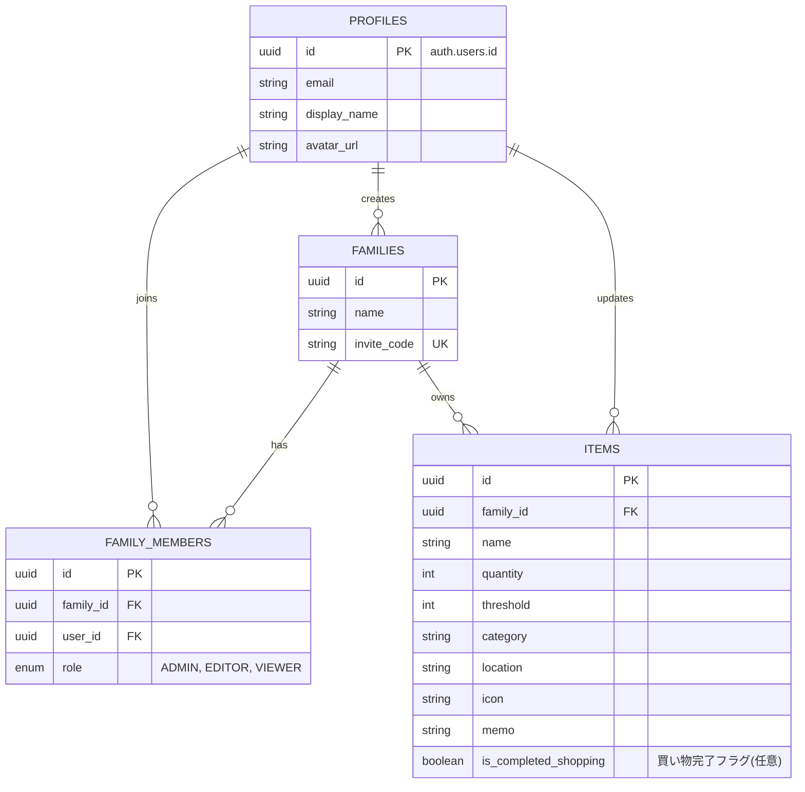

# データベース設計書 (Zaiko)

Zaikoアプリのデータベース設計（スキーマ定義）です。
Supabase (PostgreSQL) + Prisma を使用します。

## 1. ER図 (概要)



## 2. テーブル定義詳細

### 2.1 Profiles (ユーザープロフィール)
Supabase Authの `auth.users` と1対1で対応する公開プロフィールテーブル。

| Column | Type | Default | Description |
|---|---|---|---|
| id | UUID | PK | `auth.users.id` 参照 |
| email | String | - | メールアドレス |
| display_name | String? | - | 表示名 |
| avatar_url | String? | - | アバター画像URL |
| created_at | DateTime | now() | 作成日時 |
| updated_at | DateTime | updated() | 更新日時 |

### 2.2 Families (家族・グループ)
在庫を共有するグループ単位。

| Column | Type | Default | Description |
|---|---|---|---|
| id | UUID | PK, uuid() | ユニークID |
| name | String | - | 家族・グループ名 |
| invite_code | String | unique | 招待用コード (8桁英数など) |
| created_by | UUID | - | 作成者ID (Profile.id) |
| created_at | DateTime | now() | 作成日時 |
| updated_at | DateTime | updated() | 更新日時 |

### 2.3 FamilyMembers (メンバー)
ユーザーと家族の紐付け（多対多）。

| Column | Type | Default | Description |
|---|---|---|---|
| id | UUID | PK, uuid() | ユニークID |
| family_id | UUID | FK | `Families.id` |
| user_id | UUID | FK | `Profiles.id` |
| role | Enum | EDITOR | 権限 (ADMIN, EDITOR, VIEWER) |
| joined_at | DateTime | now() | 参加日時 |

**Role定義:**
- **ADMIN**: メンバー管理、家族設定変更、在庫操作全般
- **EDITOR**: 在庫操作全般（追加・編集・削除）
- **VIEWER**: 閲覧のみ

### 2.4 Items (在庫アイテム)
管理対象の在庫アイテム。

| Column | Type | Default | Description |
|---|---|---|---|
| id | UUID | PK, uuid() | ユニークID |
| family_id | UUID | FK | `Families.id` |
| name | String | - | アイテム名 |
| quantity | Int | 1 | 現在の数量 |
| threshold | Int | 1 | 通知閾値（これ以下でアラート） |
| category | String | "その他" | カテゴリ名 (Enum or String) |
| location | String? | - | 保管場所 |
| icon | String | "box" | アイコン識別子 |
| memo | String? | - | メモ |
| created_by | UUID | - | 作成者ID |
| created_at | DateTime | now() | 作成日時 |
| updated_at | DateTime | updated() | 更新日時 |

※ `status` (十分/少/切れ) は `quantity` と `threshold` からアプリ側で算出するため、カラムとしては持たない。

## 3. Prisma Schema 案

```prisma
model Profile {
  id           String   @id @default(uuid()) // auth.users.id と同期想定
  email        String
  displayName  String?
  avatarUrl    String?
  
  createdFamilies Family[] @relation("CreatedFamilies")
  memberships     FamilyMember[]
  
  createdAt    DateTime @default(now())
  updatedAt    DateTime @updatedAt
  
  @@map("profiles")
}

model Family {
  id          String   @id @default(uuid())
  name        String
  inviteCode  String   @unique
  
  createdBy   String
  creator     Profile  @relation("CreatedFamilies", fields: [createdBy], references: [id])
  
  members     FamilyMember[]
  items       Item[]
  
  createdAt   DateTime @default(now())
  updatedAt   DateTime @updatedAt
  
  @@map("families")
}

enum FamilyRole {
  ADMIN
  EDITOR
  VIEWER
}

model FamilyMember {
  id        String     @id @default(uuid())
  familyId  String
  userId    String
  role      FamilyRole @default(EDITOR)
  
  family    Family     @relation(fields: [familyId], references: [id], onDelete: Cascade)
  user      Profile    @relation(fields: [userId], references: [id], onDelete: Cascade)
  
  joinedAt  DateTime   @default(now())
  
  @@unique([familyId, userId]) // 1ユーザーは1家族に1つだけメンバーレコードを持つ
  @@map("family_members")
}

model Item {
  id          String   @id @default(uuid())
  familyId    String
  name        String
  quantity    Int      @default(1)
  threshold   Int      @default(1)
  category    String   @default("日用品") // アプリ側定数と同期
  location    String?
  icon        String   @default("box")
  memo        String?
  
  family      Family   @relation(fields: [familyId], references: [id], onDelete: Cascade)
  
  createdBy   String?  // Profile.id
  
  createdAt   DateTime @default(now())
  updatedAt   DateTime @updatedAt
  
  @@index([familyId])
  @@map("items")
}
```
